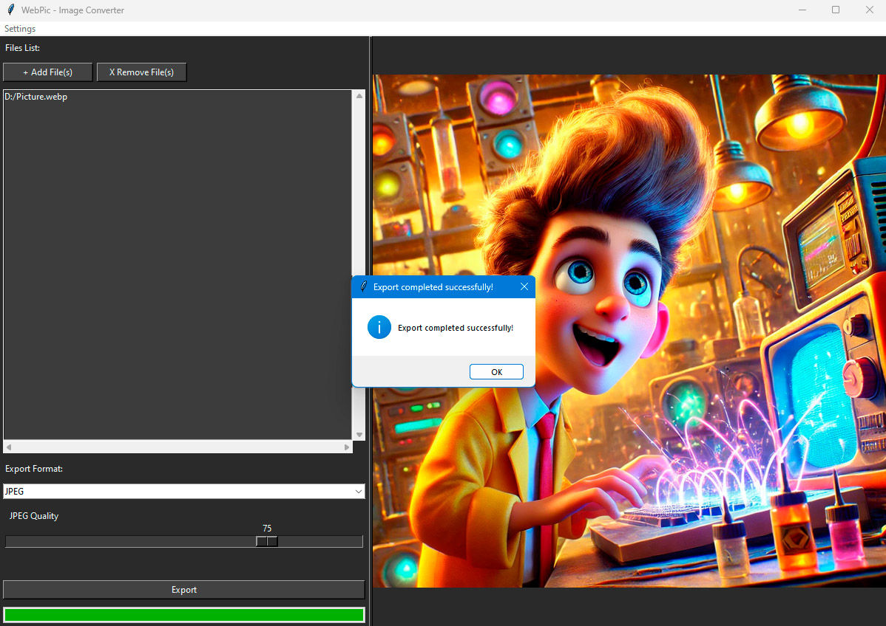

# WebPic - Image Converter

## **WebPic: High-Quality Image Converter**

WebPic is a versatile image converter designed to seamlessly transform **WebP** images into **PNG** without any loss of quality and into **JPEG** with customizable compression settings. Whether you want to maintain pristine image quality or optimize file sizes, WebPic has you covered.

### **Features:**

- **Simple Conversion:** Convert WebP images to PNG without compromising quality.
- **Customizable JPEG Compression:** Choose your desired compression level when converting to JPEG.
- **Batch Processing:** Add and convert multiple files simultaneously, saving you time.
- **Multi-language Support:** Easily add new languages for translation.
- **User-Friendly Interface:** Intuitive design ensures a smooth and efficient user experience.

### **How to Use WebPic:**

1. **Launch the Application:**
   - Run the `main.py` script using Python or execute the provided script to set up the virtual environment and launch the application.

2. **Add Images:**
   - Click the **"+ Add File(s)"** button to add individual WebP files.

3. **Select Export Format:**
   - Choose **PNG** for conversion or **JPEG** for converting to compressed images.
   - If **JPEG** is selected, adjust the compression slider to set your preferred quality level.

4. **Export Images:**
   - Click the **"Export"** button to convert and save your images to the selected directory.

5. **Manage Files:**
   - Remove unwanted files from the list using the **"X Remove File(s)"** button.

6. **Change Language:**
   - Navigate to the **Settings** menu to select your preferred language.

### **Support WebPic:**

If you find **WebPic** useful and would like to support its development, please buy me a coffee!

- **Bitcoin:** `1GdZXAJAXee2rxZ4Q5LiUFWLAxPiJKQXTj`
- **USDT TON:** `UQBV70C9yd30xTd685lQaf4Qa_crtltYo4muJNmJKAxg9DBc`
- **USDT TRC20:** `TQu3JSzyQ2W9YVLVjRfoD4cVvxBgFWaEKC`

---

# WebPic - Конвертер Изображений

## **WebPic: Высококачественный конвертер изображений**

WebPic — это универсальный конвертер изображений, предназначенный для беспроблемного преобразования изображений из формата **WebP** в **PNG** без потери качества и в **JPEG** с настраиваемыми параметрами сжатия. Независимо от того, хотите ли вы сохранить первоклассное качество изображения или оптимизировать размер файла, WebPic вам поможет.

### **Особенности:**

- **Простое преобразование:** Конвертируйте изображения WebP в PNG без потери качества.
- **Настраиваемое сжатие JPEG:** Выбирайте желаемый уровень сжатия при преобразовании в JPEG.
- **Пакетная обработка:** Добавляйте и конвертируйте несколько файлов одновременно, экономя ваше время.
- **Поддержка многоязычности:** Легко добавляйте новые языки для перевода.
- **Удобный интерфейс:** Интуитивно понятный дизайн обеспечивает плавный и эффективный опыт использования.

### **Как использовать WebPic:**

1. **Запуск приложения:**
   - Запустите скрипт `main.py` с помощью Python или выполните предоставленный скрипт для настройки виртуальной среды и запуска приложения.

2. **Добавление изображений:**
   - Нажмите кнопку **"+ Добавить файл(ы)"**, чтобы добавить отдельные файлы WebP.

3. **Выбор формата экспорта:**
   - Выберите **PNG** для преобразования или **JPEG** для преобразования в сжатые изображения.
   - Если выбран **JPEG**, отрегулируйте ползунок сжатия, чтобы установить предпочтительный уровень качества.

4. **Экспорт изображений:**
   - Нажмите кнопку **"Экспортировать"**, чтобы конвертировать и сохранить ваши изображения в выбранном каталоге.

5. **Управление файлами:**
   - Удаляйте ненужные файлы из списка с помощью кнопки **"X Убрать файл(ы)"**.

6. **Смена языка:**
   - Перейдите в меню **Настройки**, чтобы выбрать предпочитаемый язык.

### **Поддержите WebPic:**

Если вы считаете WebPic полезным и хотите поддержать его развитие, пожалуйста, купите мне кофе!

- **Bitcoin:** `1GdZXAJAXee2rxZ4Q5LiUFWLAxPiJKQXTj`
- **USDT TON:** `UQBV70C9yd30xTd685lQaf4Qa_crtltYo4muJNmJKAxg9DBc`
- **USDT TRC20:** `TQu3JSzyQ2W9YVLVjRfoD4cVvxBgFWaEKC`
